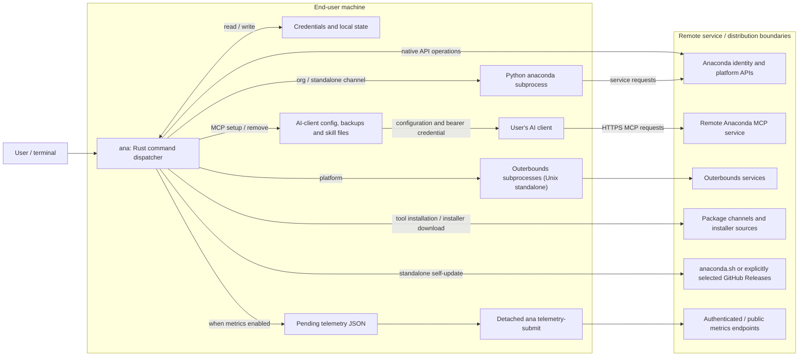
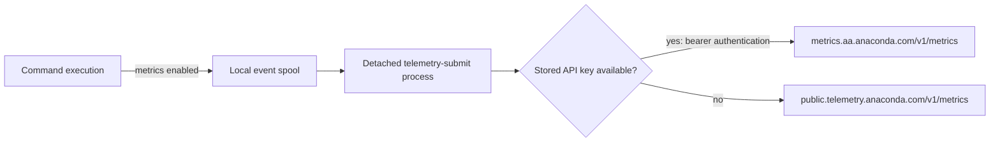
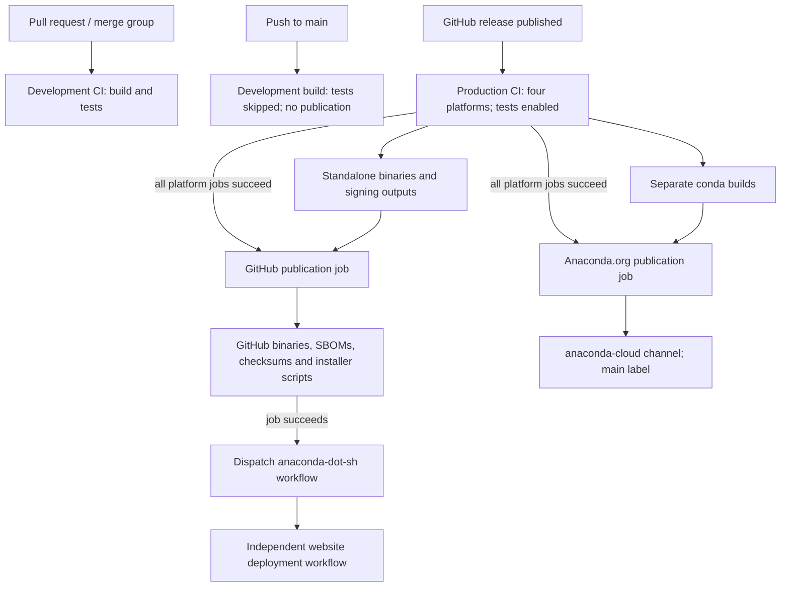
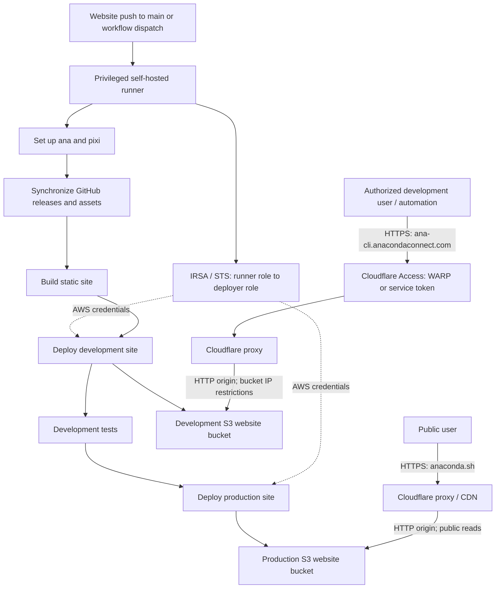
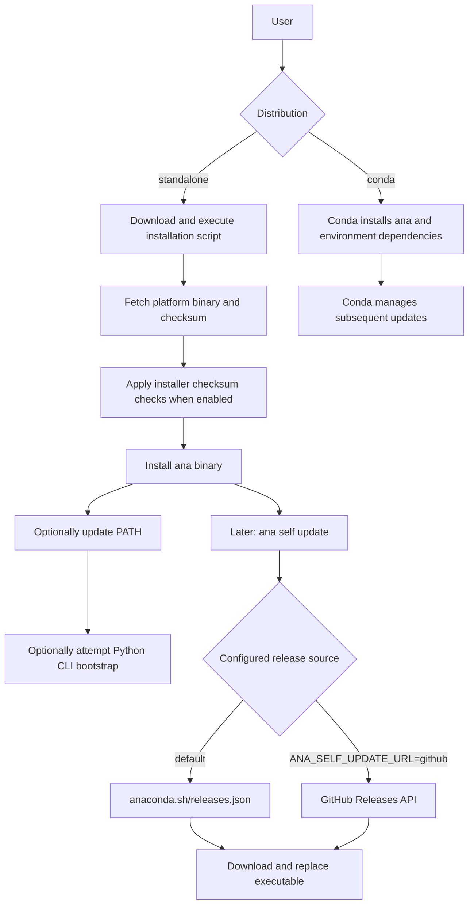

# Anaconda CLI Architecture

Anaconda CLI (`ana`) is a Rust command-line application that combines native API
operations, local configuration, managed-tool installation, and subprocess
wrappers. It is not itself the Python `anaconda` CLI, an MCP server, or the
Outerbounds execution runtime.

The standalone build provisions a catalog of tool environments from embedded
lockfiles. The conda build delegates dependency and update management to conda.
The sections below describe the implementation, its data flows, and the source
files that define each part of the system.

## Runtime and Service Boundaries

The command dispatcher creates a shared `CommandContext` for configuration,
clients and telemetry. Native command handlers use Anaconda services and local
state. Other commands invoke managed or environment-provided executables.

Native service requests use HTTPS by default. Endpoint settings and
`ANA_USE_HTTPS` control generated API URLs. Remote services own authorization
and resource-quota policies, separately from the CLI's local login gate.

### Authentication and MCP

1. Device login discovers the remote authorization endpoints, opens the browser
   and polls the token endpoint. It does not open a local OAuth callback listener.
2. Direct API-key login accepts argument, stdin or prompted input. Login validates
   the key with the service before storing it. Device login also obtains an API key.
3. Ordinary authenticated API requests use the stored API key. Most tool, feature,
   MCP and organization operations pass a central stored-credential login gate;
   server-side authorization is still required for service operations.
4. Native MCP setup writes supported AI-client configuration for `/api/mcp`,
   including a bearer credential, backups and companion skill/state. The AI
   client subsequently connects to the remote server; `ana` does not serve MCP.
5. Logout removes the current domain's stored credential. It does not automatically
   revoke the remote key or erase all telemetry and AI-client credential copies.

Sources: [dispatch](../src/cli.rs), [context](../src/context.rs),
[HTTP clients](../src/http.rs), [authentication](../src/auth/actions.rs),
[Python wrapper](../src/anaconda_cli.rs), [channels](../src/packages/run.rs),
[platform wrapper](../src/outerbounds/run.rs), [MCP setup](../src/mcp/setup.rs).

### Local Storage and Configuration

| State | Location / behavior |
| --- | --- |
| General runtime settings | Defaults plus `ANA_*` environment variables; no general configuration-file provider in `Config` |
| Experimental feature flags | Separate reader for `[ana.features]` in `$ANA_HOME/config.toml` |
| Managed tools and exposed executables | Under `ANA_HOME`, default `~/.ana`; selected tools use Unix symlinks or Windows shims |
| API credentials | Domain-keyed JSON/Base64 file, default `~/.anaconda/keyring`; separately overridable with `ANA_KEYRING_PATH`. This is encoding, not an OS credential vault. |
| MCP configuration and state | Client-specific configuration/backup locations, installed skills, and shared `.anaconda` state; credential copies cross into the AI-client boundary |
| Pending metrics | `$ANA_HOME/telemetry/pending`; removed following successful submission, with age/count cleanup policies |

Sources: [configuration](../src/config.rs), [paths](../src/paths.rs),
[experimental flags](../src/feature/experimental.rs),
[keyring](../src/auth/keyring.rs), [tool installation](../src/tools/install.rs),
[MCP clients](../src/mcp/clients.rs), [MCP state](../src/mcp/state.rs).

## Telemetry

Command metrics are buffered, serialized locally and submitted by a detached
process rather than making the foreground command wait for network export.

The default endpoints use HTTPS. Events can contain account, client and session
identifiers. `ANA_ENABLE_TELEMETRY` gates metric spooling/export. HTTP user-agent
identity and optional Sentry diagnostics have separate implementation paths and
configuration.

Sources: [event attributes](../src/context.rs), [spool](../src/telemetry/spool.rs),
[spawn](../src/telemetry/spawn.rs), [submission](../src/telemetry/submit.rs),
[OTel endpoint selection](../src/telemetry/otel.rs),
[user agent](../src/ua/mod.rs), [optional diagnostics](../src/diagnostics.rs).

## Build and Release

GitHub Actions builds Linux x86_64/ARM64, macOS ARM64 and Windows x86_64. Each
platform job produces a standalone binary and a separately built conda package.
The standalone Windows binary and shim pass through signing actions, and the
macOS binary passes through signing and production notarization. The conda recipe
compiles its own binary separately from those standalone artifacts.

The diagram summarizes artifact and job dependencies, not the ordering of every
step inside a platform job.

Build tooling is specified through Pixi and Cargo. Release versioning comes from
Git tags through the version wrapper and `PKG_VERSION`, not the `0.0.0` placeholder
in `Cargo.toml`. Credentials from Vault support signing and testing; Windows
signing uses AzureSignTool/Azure Key Vault integration, and macOS notarization
uses Apple's service. Site dispatch uses a separate Vault-provided PAT.

Publication flow:

- A tag push alone is not the configured release trigger.
- GitHub and conda publication are independent jobs after CI. One can succeed
  while the other fails. The conda upload selects the `anaconda-cloud` channel,
  `main` label, private visibility, and forced replacement of existing packages.
- The GitHub job regenerates the SBOM with `pixi run sbom-force`, passing the
  release tag as `SBOM_RELEASE_VERSION`, and uploads the resulting JSON and
  Markdown alongside binaries, SHA-256 files, and installer scripts.
- Stable releases are marked latest; prereleases retain their prerelease status
  and are not marked latest.
- The site deployment is dispatched after GitHub publication succeeds. Dispatch
  and deployment run in separate workflows.

Sources: [CI workflow](../.github/workflows/ci.yaml),
[release workflow](../.github/workflows/release.yaml), [Pixi tasks](../pixi.toml),
[version wrapper](../scripts/with_version.py), [conda recipe](../conda.recipe/recipe.yaml),
[Windows signing](../.github/actions/sign-windows/action.yaml),
[macOS signing](../.github/actions/sign-notarize-macos/action.yaml),
[SBOM generation](../scripts/update_lockfiles.sh),
[SBOM metadata processing](../scripts/sbom-process.py).

## Website Deployment and Hosting

The `anaconda.sh` site is implemented in the separate
[anaconda-dot-sh repository](https://github.com/anaconda/anaconda-dot-sh).
Its deployment workflows build and publish static pages and release assets;
Terraform defines the S3, Cloudflare and IAM resources shown below.

Terraform configures HTTPS at the Cloudflare edge and HTTP between Cloudflare and
the S3 website endpoint. Development access combines Cloudflare Access policy
with bucket IP restrictions. The production bucket policy permits public reads.

Sources:
[deployment workflow](https://github.com/anaconda/anaconda-dot-sh/blob/main/.github/workflows/deploy.yaml),
[deployment action](https://github.com/anaconda/anaconda-dot-sh/blob/main/.github/actions/deploy/action.yaml),
[IAM](https://github.com/anaconda/anaconda-dot-sh/blob/main/infra/terraform/anaconda-dot-sh/iam.tf),
[S3](https://github.com/anaconda/anaconda-dot-sh/blob/main/infra/terraform/anaconda-dot-sh/s3.tf),
[Cloudflare](https://github.com/anaconda/anaconda-dot-sh/blob/main/infra/terraform/anaconda-dot-sh/cloudflare.tf).

## Installation and Update Paths

Standalone installation, CLI self-update, conda lifecycle management, managed-tool
installation, and Miniconda download are different paths with different controls.

The GitHub update source is explicitly selected, not an automatic fallback on
static-site failure. Self-update downloads the selected executable and replaces
the running binary without a checksum/signature verification step. Installer
scripts have their own checksum checks and bypass/fallback paths. Bootstrap goes
through the login gate and can fail without undoing the binary installation.

Managed tools use embedded Pixi lockfiles and rattler installation into CLI-owned
prefixes. The `main` package source is `https://repo.anaconda.com/pkgs/main`, not
the Git branch; a lockfile override is a separate configuration choice. The
managed Python CLI deliberately has no public `anaconda` symlink.

Miniconda download is a native operation that verifies the manifest SHA-256 and
prints an installation command. It does not execute the installer or use the
managed-tool prefix workflow.

| Capability | Standalone | Conda package |
| --- | --- | --- |
| Self-update | Available | Disabled; use conda |
| Managed-tool lifecycle | CLI-owned prefixes and lockfiles | Disabled; dependencies come from conda |
| Bootstrap | Installs managed Python CLI | No-op |
| Organization commands | Managed Python CLI subprocess | Environment Python CLI subprocess |
| Channel commands | Available | Not exposed |
| Platform commands | Unix only | Not exposed |
| Native MCP setup and Miniconda download | Available | Available |

Sources: [shell installer](../scripts/install.sh), [PowerShell installer](../scripts/install.ps1),
[self-update](../src/update.rs), [feature gates](../build.rs),
[tool specifications](../src/tools/specs.rs), [tool installation](../src/tools/install.rs),
[Miniconda download](../src/installer/mod.rs).

## Shared GitHub Action Helpers

These helpers live in [anaconda/actions](https://github.com/anaconda/actions) and
run inside GitHub Actions, not as additional CLI runtime services. The consuming
workflow's `uses` entry selects the action revision; its inputs select the tool
versions and publication settings.

| Helper | Flow and caller boundary |
| --- | --- |
| `setup-anaconda-cli` | Runs the installer without PATH modification/bootstrap, adds paths via `GITHUB_PATH`, then optionally installs tools. The [CI](../.github/workflows/ci.yaml) and [release](../.github/workflows/release.yaml) callers select a CLI version and request pixi. |
| `upload-package` | Validates inputs and installs its CLI/tool dependencies when needed. It supports Anaconda.org and PSM targets; this repository's [release workflow](../.github/workflows/release.yaml) selects Anaconda.org. |

## Trust Boundaries

| Boundary | Implementation |
| --- | --- |
| User environment to CLI configuration | Environment variables select paths/endpoints. `ANA_USE_HTTPS` controls the generated base URL's scheme; native clients use their default certificate validation, independently of the parsed `ANA_SSL_VERIFY` setting. |
| CLI credentials to remote destinations | HTTP authentication middleware attaches credentials to selected destinations. Remote services handle authentication and authorization separately from the CLI's stored-key login gate. |
| CLI storage to AI-client configuration | API keys reside in the file keyring and are copied into AI-client configuration during MCP setup. New Unix keyring files request owner-only permissions; Windows writes use inherited filesystem ACLs. |
| Downloaded packages/executables to local execution | Installer, managed-tool, self-update and conda paths have different integrity controls. Managed installation enables package link scripts, and wrappers invoke external executables. |
| CI identity to signing/publication | GitHub workload identity authenticates to Vault, which supplies credentials for signing, testing, publication and site dispatch to their respective jobs. |
| Cloudflare edge to S3 origin | TLS terminates at Cloudflare; the configured S3 website origin uses HTTP. Edge access policies and bucket policies form separate access-control layers. |
| Local telemetry to remote processing | Metrics are spooled on disk and exported by a separate process. HTTP user-agent identity and optional diagnostics follow separate code paths. |
