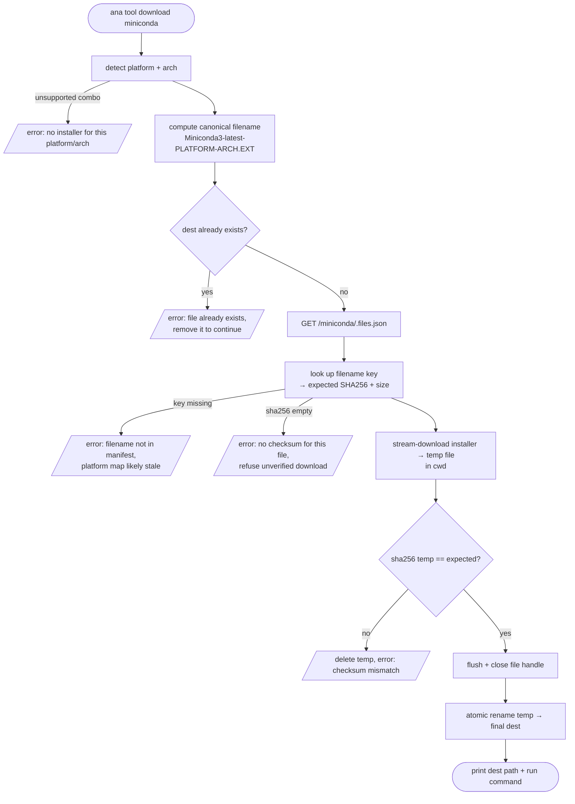

# Implementation Plan: `ana tool download miniconda`

**Status:** Ready to build — Jun 8, 2026. **Repo:** `anaconda/anaconda-cli`
**Companion docs:** `flowchart-install-miniconda.md`, `design-note-ana-installer-run.md` (superseded).

## What this is

`ana tool download miniconda` fetches the latest official Miniconda installer for the
current platform/arch, verifies its checksum, writes it to the current directory, and
prints the exact command to run it. **ana does not run the installer.**

> **Command placement note (PM call):** the command lives under `ana tool download` to
> sit next to the existing tool-management verbs in the CLI surface. That's a *namespace*
> decision only — the implementation does **not** live in `src/tools/` (see Code
> structure). CLI placement and code placement are separate; download shares no machinery
> with the managed-tool install path.

### Where did this come from?

I got a new laptop from IT. I wanted to get miniconda installed on my machine. I knew we had launched (or were about to launch) `ana`. So I installed it, assuming that I could install miniconda from `ana`. But ana doesn't have that yet. So I had started thinking through whether or not we could make `ana install miniconda` a thing. But that has a number of concerns that are real and need to be figured out from an organizational POV.

ana install miniconda would be great, but it also would override all of the user-facing stuff that miniconda does now:

```
Installs Miniconda3 py313_26.3.2-2
-b           run install in batch mode (without manual intervention),
             it is expected the license terms (if any) are agreed upon
-f           no error if install prefix already exists
-h           print this help message and exit
-p PREFIX    install prefix, defaults to /Users/ericdill/miniconda3, must not contain spaces.
-s           skip running pre/post-link/install scripts
-m           disable the creation of menu items / shortcuts
-u           update an existing installation
-t           run package tests after installation (may install conda-build)
-c           run 'conda init' after installation (only applies to batch mode)
```


so, the option space here is bounded by:

1. just choose some sane defaults for the user that runs this
2. fully expose all these options to ana install miniconda

neither of which is great. if we do (1) then we're masking the miniconda UX and making new installer UX choices implicitly, which i'd only accept if we thought really hard about what we wanted to wrap and why. It also means that we need to walk the legal tightrope within the ana install minicodna path and then we have yet another place here at anaconda where we're trying to maintain an unified legal position.

if we do (2) then we're just replicating the miniconda interface for very little benefit.

so, thinking more about what i actually wanted: a way to install miniconda from the terminal. i just didnt want to open my web browser and navigate to where is the actual shell script i need to download and run. and that is a very easily solvable problem within ana.

ana tool download miniconda is really simple, it sidesteps all of the "should ana be able to run an installer" and the "should ana be able to create a conda env from a lockfile" and all of these things. the only thing that ana needs to do with this workflow is download the installer and then tell me how to run it.

so anyway, the thing that I think would solve my use case would have ana grow a "download an installer for me and tell me where it is and tell me how to run it"

CI SIDEBAR... (TODO in a later PR. calling it out here for some future breadcrumbs)
this also might be really helpful on ci?? `install ana && ana tool download miniconda --output /tmp/mc.sh && bash /tmp/mc.sh -b -p /tmp/miniconda` is now a thing that would be totally portable?? Don't implement this immediately.

## Surface

```
ana tool download miniconda
```

No args. downloads latest for your current platform. I KNOW that we will want to support other downloads at some point. But we can do that later.

downloads to your current directory

## Flow



> ⚠️ **Close the temp file handle before the rename.** On Windows, renaming a file
> that still has an open handle fails with a sharing violation — and Windows is a
> shipped target (the `.exe`). `file.flush().await` then `drop(file)` before
> `rename`. (Caught in code review on the v1 implementation.)
>
> ⚠️ **Compare the checksum case-insensitively** (`eq_ignore_ascii_case`). Anaconda's
> manifest serves lowercase hex today, so this is hardening, not an active bug — but
> a case-sensitive compare would spuriously fail if that ever changed.

## Platform / arch → filename mapping

| OS detection      | ana arch | filename arch | ext   |
|-------------------|----------|---------------|-------|
| macOS, aarch64    | arm64    | `arm64`       | `.sh` |
| macOS, x86_64     | x86_64   | `x86_64`      | `.sh` |
| Linux, x86_64     | x86_64   | `x86_64`      | `.sh` |
| Linux, aarch64    | aarch64  | `aarch64`     | `.sh` |
| Windows, x86_64   | x86_64   | `x86_64`      | `.exe`|

Filename: `Miniconda3-latest-{MacOSX|Linux|Windows}-{arch}.{sh|exe}`
Base URL (v1): `https://repo.anaconda.com/miniconda/`

Any OS/arch combo not in the table → clean error (don't guess a URL that 404s).

### What `latest` actually points at (and what we deliberately ship)

There are 13 `Miniconda3-latest-*` aliases in the manifest. Their `mtime` cleanly splits
"still shipping" from "frozen years ago" — sorted by `mtime`:

| mtime (UTC)          | size     | filename                              | we ship?  |
|----------------------|----------|---------------------------------------|-----------|
| 2015-08-24 17:34:00  | 31.3 MB  | `Miniconda3-latest-Linux-armv7l.sh`   | no        |
| 2015-08-24 17:34:00  | 27.2 MB  | `Miniconda3-latest-MacOSX-x86.sh`     | no        |
| 2019-01-02 16:05:14  | 65.7 MB  | `Miniconda3-latest-Linux-x86.sh`      | no        |
| 2022-05-16 19:57:25  | 71.1 MB  | `Miniconda3-latest-Windows-x86.exe`   | no        |
| 2023-11-16 19:51:52  | 99.5 MB  | `Miniconda3-latest-Linux-ppc64le.sh`  | no        |
| 2025-02-11 21:04:49  | 150.4 MB | `Miniconda3-latest-Linux-s390x.sh`    | no        |
| 2025-08-25 20:52:24  | 117.8 MB | `Miniconda3-latest-MacOSX-x86_64.pkg` | no (.pkg) |
| 2025-08-25 20:52:24  | 118.4 MB | `Miniconda3-latest-MacOSX-x86_64.sh`  | **yes**   |
| 2026-04-28 17:57:16  | 164.4 MB | `Miniconda3-latest-Linux-aarch64.sh`  | **yes**   |
| 2026-04-28 17:57:16  | 163.2 MB | `Miniconda3-latest-Linux-x86_64.sh`   | **yes**   |
| 2026-04-28 17:57:16  | 126.6 MB | `Miniconda3-latest-MacOSX-arm64.pkg`  | no (.pkg) |
| 2026-04-28 17:57:16  | 127.4 MB | `Miniconda3-latest-MacOSX-arm64.sh`   | **yes**   |
| 2026-04-28 17:57:16  | 99.2 MB  | `Miniconda3-latest-Windows-x86_64.exe`| **yes**   |

- **The five rows we ship move together.** They share one recent `mtime` (the macOS Intel
  `.sh` lags one release but is still maintained). Anaconda re-points every live `latest`
  alias in a single batch per release, so there's no "some platforms lag" race.
- **`mtime` is a real liveness signal.** The frozen aliases (`Linux-x86`, `MacOSX-x86`,
  `armv7l`, `ppc64le`, `s390x`, `Windows-x86`) still resolve and would download, but their
  `latest` pointer hasn't moved in 1–11 years. We intentionally don't map any
  `detect_target()` output to them. If we ever add an arch and its `latest` mtime is
  ancient, that's the tell it's effectively dead even though the key exists.
- **We pick `.sh` over `.pkg` on macOS on purpose.** Both aliases exist per mac arch; the
  `.pkg` is the GUI installer, the `.sh` is the one the user `bash`-es. Our whole UX is
  "here's the file, here's the `bash` command," so `.sh` is the only fit.

## Checksum source & verification

`https://repo.anaconda.com/miniconda/.files.json` — one JSON manifest keyed by filename
(includes the `-latest-` aliases):

```json
{
  "Miniconda3-latest-Linux-x86_64.sh": {
    "md5": "5eb314581f476f57526204386ea87af8",
    "mtime": 1777399036.7642996,
    "sha256": "2284bafb7863a23411b19874d216e237964d4b32dd9beb6807fa8b2d84570961",
    "size": 163179296
  }
}
```

(The `/archive/.files.json` cousin holds the Anaconda Distribution installers, same shape
— useful for a later distribution-download feature.)

**Strategy:** GET `.files.json`, look up our computed filename key, read `sha256` (and
`size` for the progress label). Stream-download the installer, compute sha256, compare.
One small JSON fetch plus the download.

> ⚠️ Don't assume the manifest always has our key or a non-empty `sha256`. Key missing →
> "filename not in manifest, platform map likely stale." `sha256` empty/missing → fail
> closed: refuse, don't download unverified. Both are real defensive cases, not theoretical.

## Code structure (anaconda-cli)

This is a *download + verify* command, NOT a `tool install` (no rattler, no lockfile, no
prefix, no symlinks). It does **not** go through `src/tools/`. New, self-contained:

- **`src/installer/mod.rs`** (new module) — the `download` command.
  - `detect_target() -> Result<Target>` — `(platform, arch)` → `Target { filename, url }`
    via `std::env::consts::{OS, ARCH}`. Errors on unsupported combos.
  - `fetch_manifest() -> Result<HashMap<String, FileEntry>>` — GET `.files.json`,
    serde-deserialize. `FileEntry { md5, sha256, size, mtime }`. Take a `base_url`
    parameter (default the public miniconda URL) so the `/archive/` reuse and the
    follow-on config work drop in without a rewrite.
  - `expected_for(manifest, filename) -> Result<&FileEntry>` — key lookup; errors on
    missing key (stale map) or empty `sha256` (refuse unverified).
  - `download_and_verify(client, url, expected_sha, dest)` — stream to temp in dest's
    dir, sha256 as we read, flush+close the handle, then compare and atomic-rename on
    match / delete on mismatch.
  - `run(ctx, args) -> Result<()>` — orchestrates; prints dest + run-command on success.
- **CLI wiring** — register a `download <name>` subcommand *under the existing `tool`
  group* (so the surface is `ana tool download miniconda`; name is `miniconda` only in v1,
  reject others with "only miniconda supported in v1"). Match the existing clap derive
  pattern used by `ana tool`. The clap handler dispatches into `src/installer::run()` —
  CLI placement under `tool` does **not** mean the code lives in `src/tools/`.
- **Reuse:** get the HTTP client from `ctx` — **`ctx.download_client()`** (no-gzip,
  binary-optimized, already wraps the standard middleware: retries, user-agent). Thread
  `ctx: &CommandContext` into `run` and pass the client down to `fetch_manifest` /
  `download_and_verify`. **Do not build a `reqwest::Client` inline** — CLAUDE.md mandates
  `ctx` clients ("never construct a new `Client`"). (The `install.rs:101` raw-builder
  pattern is rattler-specific; don't copy it for an ordinary HTTP command — doing so was
  flagged in code review.) sha256 via the `sha2` crate (transitively present via rattler;
  add it as a direct dep — it's not one by default).

### Why a new module, not `src/tools/`

`tools/` is rattler-lockfile installs into `~/.ana/tools/<name>` with bin symlinks. This
shares none of that machinery — it's an HTTP download to the cwd. Forcing it through
`tools/` would mean gutting the install path. Keep them separate.

## Success output

macOS / Linux:
```
Downloaded Miniconda3-latest-MacOSX-arm64.sh (127.4 MB) to:
    ./Miniconda3-latest-MacOSX-arm64.sh
SHA256 verified.

To install, run:
    bash ./Miniconda3-latest-MacOSX-arm64.sh
```

Windows:
```
Downloaded Miniconda3-latest-Windows-x86_64.exe (99.2 MB) to:
    .\Miniconda3-latest-Windows-x86_64.exe
SHA256 verified.

To install, run it from Explorer, or:
    start "" ".\Miniconda3-latest-Windows-x86_64.exe"
```

## File already exists at the target

We download to cwd, so on a re-run (or a leftover browser download)
`Miniconda3-latest-MacOSX-arm64.sh` may already be there. **Insta-fail.** Before
fetching anything, check the destination; if it exists, error out:

```
error: ./Miniconda3-latest-MacOSX-arm64.sh already exists. Remove it if you want to continue.
```

No overwrite, no clobber, no `-f` in v1, no sha-match-skip cleverness. Check it *early* —
before the manifest fetch and download — so we don't pull 120 MB only to refuse at the
rename. `-f` to overwrite is the obvious next flag, but it's a follow-on (see below);
don't build it now.

## Testing

- **Unit:** `detect_target(base_url, os, arch)` for all 5 rows + an unsupported combo.
  Made pure by taking `(os, arch)` args (the chosen approach — production calls it with
  `std::env::consts::{OS, ARCH}`). Cleaner than the `temp_env` OS/ARCH mock and avoids a
  duplicated match block.
- **Unit:** manifest parser against a captured fixture of real `.files.json` (commit a
  trimmed snapshot — a handful of keys incl. one `-latest-`). Assert the right SHA for a
  known filename; assert key-missing and empty-sha256 errors.
- **Unit:** extract the verify-and-finalize step into a `finalize_verified_download(temp,
  actual_sha, expected_sha, dest)` helper that takes already-computed bytes/hash, so the
  mismatch (temp deleted, error, no dest) *and* match (renamed, dest exists) paths are both
  testable without a network mock. Don't re-implement the compare inline in the test — that
  asserts on copied code and covers nothing. Include a case-insensitive (uppercase-expected)
  case here.
- **Integration (gated/manual):** real download of the smallest installer, full verify +
  rename. Mark `#[ignore]` so CI doesn't pull 120 MB every run.

## Follow-ons

Deliberately out of v1. `ana tool download miniconda` is useful on its own; these layer
on without changing its core behavior.

- **`-f` / `--force` to overwrite an existing file.** The obvious next flag — turns the
  "file already exists" insta-fail into "remove it and re-download." Nice symmetry: the
  Miniconda installer's own `-f` means "no error if install prefix already exists," so
  `ana tool download miniconda -f` reading as "no error if the download target already exists"
  is consistent with the tool we're fetching.
- **Configurable / login-aware installer host.** Don't hardcode `repo.anaconda.com`
  forever. ana already treats other remotes as config-driven — `ANA_DOMAIN` (auth),
  `ANA_PIP_INDEX_URL` (packages) via `src/config.rs`/figment. A later PR resolves the
  installer base URL in order: explicit `ANA_INSTALLER_BASE_URL` override → logged-in
  customer's configured installer host → public default. The logged-in rung needs a
  server field that doesn't exist yet (`whoami`'s `/api/auth/sessions/whoami` payload
  carries no installer/repo URL today), so it's blocked on the platform team. v1 keeps
  `fetch_manifest` parameterized by base URL so this drops in cleanly; v1 just always
  passes the public default. **Air-gapped customers can't reach `repo.anaconda.com` —
  this is why it eventually matters, but it's not a v1 blocker.**
- **`--output PATH`.** Choose the download location instead of cwd. Unlocks the CI use
  case: `ana tool download miniconda --output /tmp/mc.sh && bash /tmp/mc.sh -b -p /tmp/miniconda`.
- **Other distributions / versions.** Anaconda Distribution via `/archive/.files.json`
  (no `latest` alias — needs an explicit version), pinned Miniconda versions.
